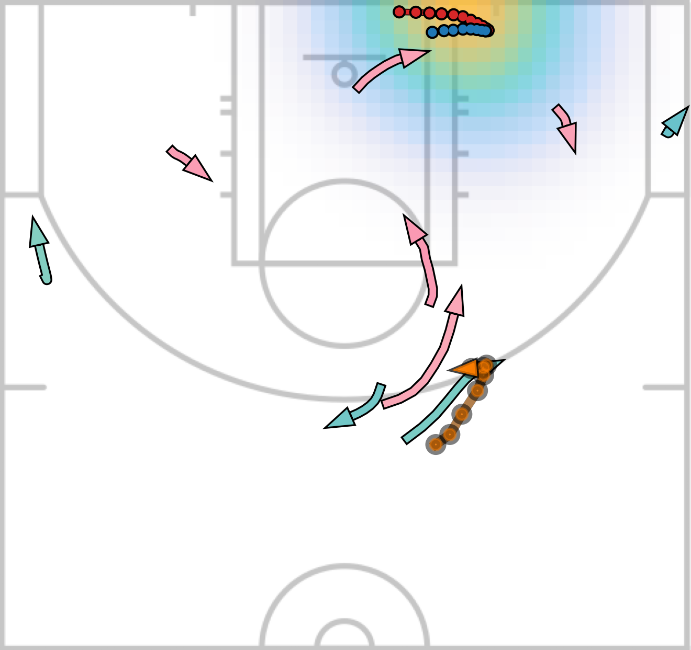
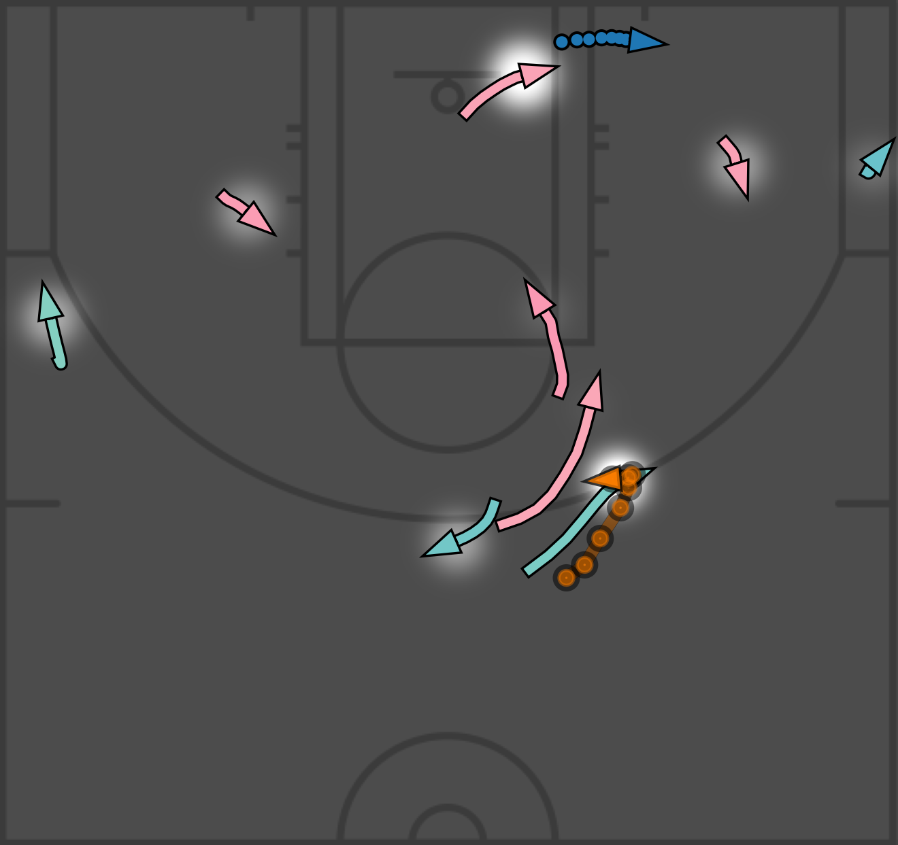
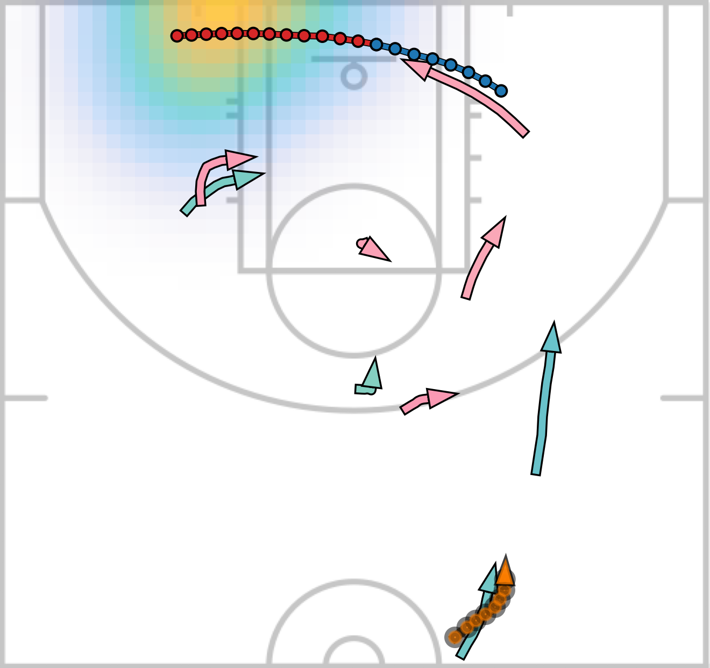
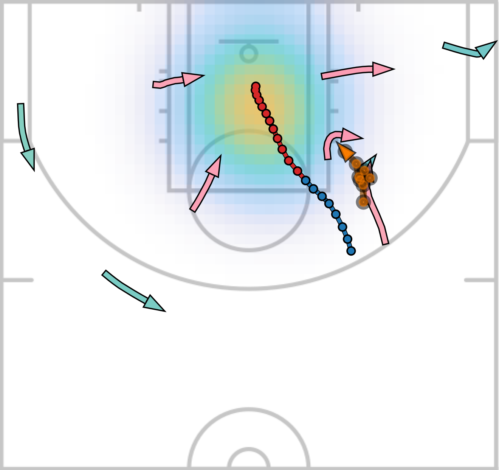

# SocialVAE: Human Trajectory Prediction using Timewise Latents

This is the official implementation for _**SocialVAE: Human Trajectory Prediction using Timewise Latents**_. [[arXiv](https://arxiv.org/abs/2203.08207)]

_**Abstract**_ -- Predicting pedestrian movement is critical for human behavior analysis and also for safe and efficient human-agent interactions. 
However, despite significant advancements, it is still challenging for existing approaches to capture the uncertainty and multimodality of human navigation decision making. 
In this paper, we propose SocialVAE, a novel approach for human trajectory prediction. The core of SocialVAE is a timewise variational autoencoder architecture that exploits stochastic recurrent neural networks to perform prediction,
combined with a social attention mechanism and backward posterior approximation to allow for better extraction of pedestrian navigation strategies.
We show that SocialVAE improves current state-of-the-art performance on several pedestrian trajectory prediction benchmarks,
including the ETH/UCY benchmark, the Stanford Drone Dataset and SportVU NBA movement dataset.

Our approach shows low errors in trajectory prediction on challenging scenarios with complex and intensive human-human interctions. Below we show the prediction of our model for basketball players. We also include our NBA datasets (`data/nba`) in this repository. **Caution:** the NBA datasets were recorded in the unit of feet. Please refer to our paper for more details.
| Predictions | Heatmap | Attention |
|-------------|---------|-----------|
|  |  |  |
|  |  |  |
|  |  |  |

## Dependencies

- Pytorch 1.11
- Numpy 1.21

We recommend to install all the requirements through Conda by

    $ conda create --name <env> --file requirements.txt -c pytorch -c conda-forge

## Code Usage

Command to train a model from scratch:

    $ python main.py --train <train_data_dir> --test <test_data_dir> --ckpt <checkpoint_dir> --config <config_file>

We provide the training and testing data in `data` folder and the configuration files that we used in `config` folder. 
To reproduce the reported results, please run

    # ETH/UCY benchmarks
    $ python main.py --train data/eth/train --test data/eth/test --ckpt log_eth --config config/eth.py
    $ python main.py --train data/hotel/train --test data/hotel/test --ckpt log_hotel --config config/hotel.py
    $ python main.py --train data/univ/train --test data/univ/test --ckpt log_univ --config config/univ.py
    $ python main.py --train data/zara01/train --test data/zara01/test --ckpt log_zara01 --config config/zara01.py
    $ python main.py --train data/zara02/train --test data/zara02/test --ckpt log_zara02 --config config/zara02.py

    # SDD benchmark
    $ python main.py --train data/sdd/train --test data/sdd/test --ckpt log_sdd --config config/sdd.py

    # NBA benchmark
    $ python main.py --train data/nba/rebound/train --test data/nba/rebound/test --ckpt log_rebound --config config/nba_rebound.py
    $ python main.py --train data/nba/score/train --test data/nba/score/test --ckpt log_score --config config/nba_score.py

## Evaluation and Pre-trained Models

Command to evaluate a pre-trained model:

    $ python main.py --test <test_data_dir> --ckpt <checkpoint_dir> --config <config_file>

We provide our pretained models in `models` folder. To evaluate our pre-trained models, please run

    # ETH/UCY benchmarks
    $ python main.py --test data/eth/test --ckpt models/eth --config config/eth.py
    $ python main.py --test data/hotel/test --ckpt models/hotel --config config/hotel.py
    $ python main.py --test data/univ/test --ckpt models/univ --config config/univ.py
    $ python main.py --test data/zara01/test --ckpt models/zara01 --config config/zara01.py
    $ python main.py --test data/zara02/test --ckpt models/zara02 --config config/zara02.py

    # SDD benchmark
    $ python main.py --test data/sdd/test --ckpt models/sdd --config config/sdd_pixel.py

    # NBA benchmark
    $ python main.py --test data/nba/rebound/test --ckpt models/nba/rebound --config config/nba_rebound.py
    $ python main.py --test data/nba/score/test --ckpt models/nba/score --config config/nba_score.py

Due to the large size of NBA scoring dataset (592,640 trajectories), it may take about 2 hours to perform a full test with FPC. To run the model without FPC for fast testing, please use `--no-fpc` option.

All our training and testing were done on machines equipped with V100 GPU. The test results may vary a little when the model runs on machines with different hardware or a different version of pytorch/cuda. 

## Training New Models

### Prepare your own dataset

Our code supports loading trajectories from multiple files, each of which represent a scene. Just split your data into training and testing sets and put each scene as a `txt` file into the corresponding folder.

Each line in the data files is in the format of

    frame_ID:int  agent_ID:int  pos_x:float  pos_y:float  group:str

where `frame_ID` and `agent_ID` are integers and `pos_x` and `pos_y` are float numbers. The `group` field is optional to identify the agent type/group such that the model can be trained to perform prediction for specific groups/types of agents. See `config/nba_rebound.py` for an example where the model is trained to predict the movement of players only and the basketball appears only as a neighbor of other agents.

### Setup your config file

We provide our config files in `config` folder, which can be used as reference.

A key hyperparameter that needs to pay attention is `NEIGHBOR_RADIUS`. In a common scenario with causal human walking, it can be values from 2 to 5. For intensive human movement, it could be 5-10 and even larger.

### Training

    $ python main.py --train <folder_of_training_data> --test <folder_of_testing_data> --ckpt <checkpoint_folder> --config <config_file>

### Evaluation

    $ python main.py --test <folder_of_testing_data> --ckpt <checkpoint_folder> --config <config_file>

The script will automatically run FPC hyperparameter finetuning after the training is done. To manually perform the finetuning given an existing model, please run the evaluation command with `--fpc_finetune` option.

