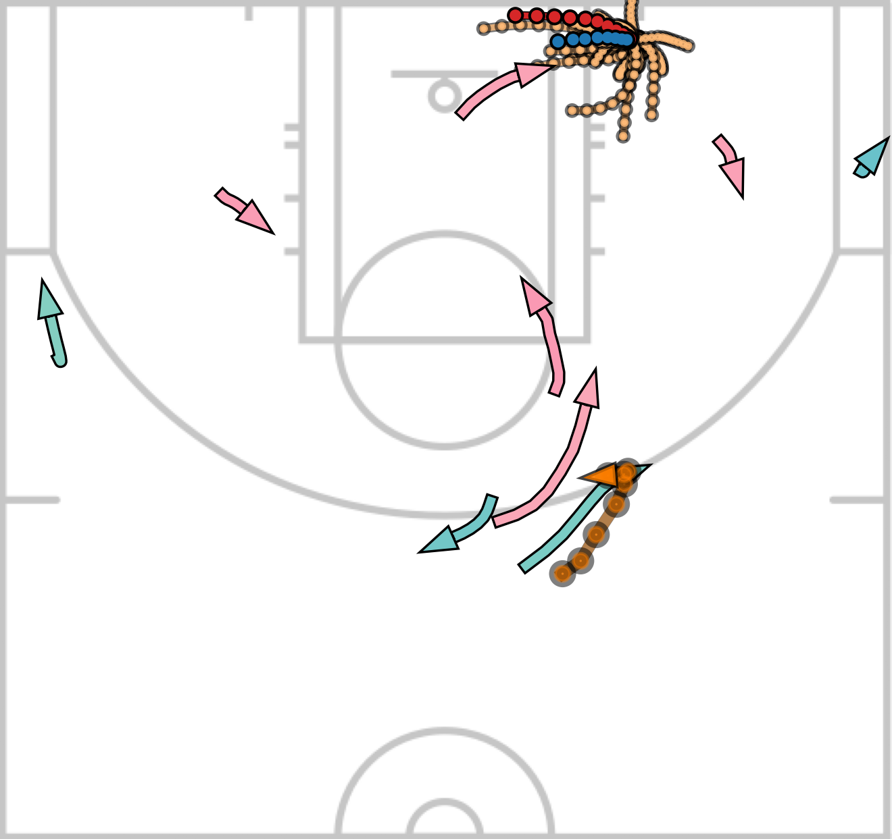
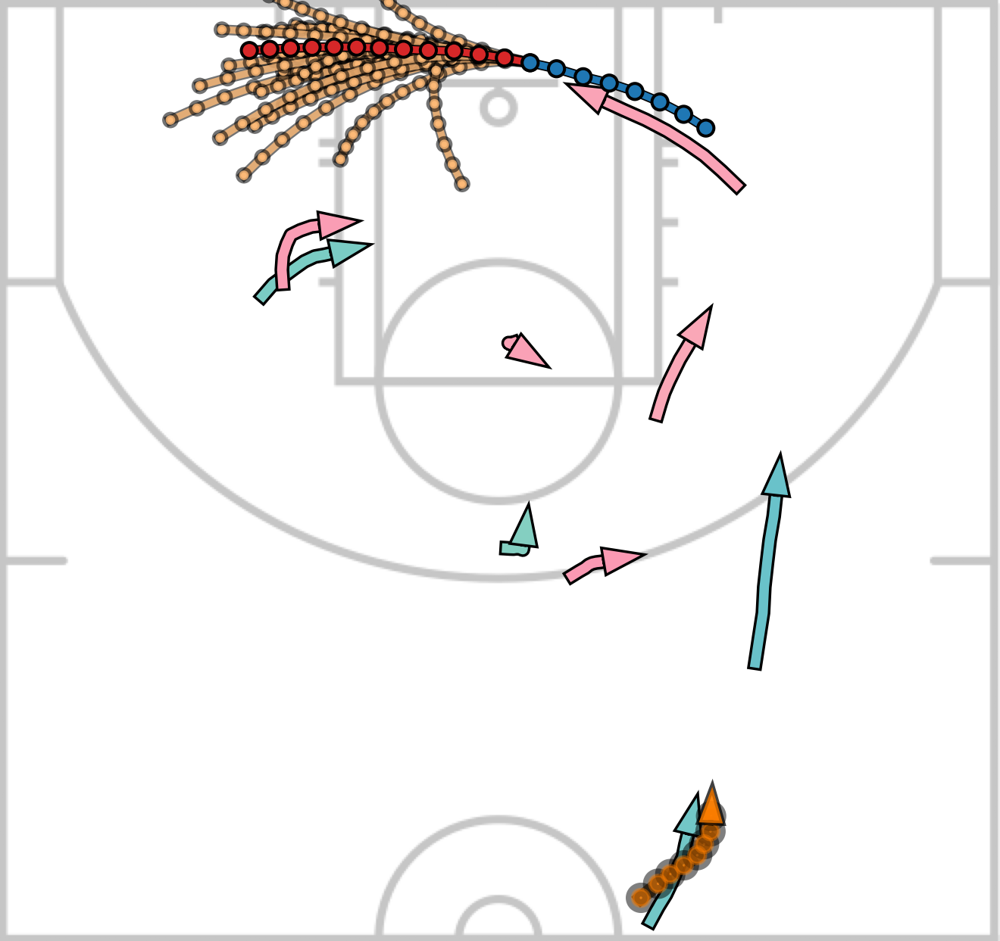

# SocialVAE: Human Trajectory Prediction using Timewise Latents

This repository is to support the paper _**SocialVAE: Human Trajectory Prediction using Timewise Latents**_.

_**Abstract**_ -- Predicting pedestrian movement is critical for human behavior analysis and also for safe and efficient human-agent interactions. 
However, despite significant advancements, it is still challenging for existing approaches to capture the uncertainty and multimodality of human navigation decision making. 
In this paper, we propose SocialVAE, a novel approach for human trajectory prediction. The core of SocialVAE is a timewise variational autoencoder architecture that exploits stochastic recurrent neural networks to perform prediction,
combined with a social attention mechanism and backward posterior approximation to allow for better extraction of pedestrian navigation strategies.
We show that SocialVAE improves current state-of-the-art performance on several pedestrian trajectory prediction benchmarks,
including the ETH/UCY benchmark, the Stanford Drone Dataset and SportVU NBA movement dataset.

Our approach shows low errors in trajectory prediction on challenging scenarios with complex and intensive human-human interctions. Below we show the prediction of our model for basketball players. We also include our NBA datasets(`data/nba`) in this repository. **Caution:** the NBA datasets were recorded in the unit of feet. Please refer to our paper for more details.
| Predictions | Heatmap | Attention |
|-------------|---------|-----------|
|  |  |  |
|  |  |  |
|  |  |  |

## Dependencies

- Pytorch 1.8
- Numpy 1.19

We recommend to install all the requirements through Conda by

    $ conda create --name <env> --file requirements.txt -c pytorch -c conda-forge

## Code Usage

Command to train a model from scratch:

    $ python main.py --train_data <train_data_dir> --test_data <test_data_dir> --ckpt_dir <checkpoint_dir> --config <config_file>

For example,

    # ETH/UCY benchmarks
    $ python main.py --train_data data/eth/train --test_data data/eth/test --ckpt_dir log_eth --config config.eth_ucy
    $ python main.py --train_data data/hotel/train --test_data data/hotel/test --ckpt_dir log_hotel --config config.eth_ucy
    $ python main.py --train_data data/univ/train --test_data data/univ/test --ckpt_dir log_univ --config config.eth_ucy
    $ python main.py --train_data data/zara01/train --test_data data/zara01/test --ckpt_dir log_zara01 --config config.eth_ucy
    $ python main.py --train_data data/zara02/train --test_data data/zara02/test --ckpt_dir log_zara02 --config config.eth_ucy

    # SDD benchmark
    $ python main.py --train_data data/sdd/train --test_data data/sdd/test --ckpt_dir log_sdd --config config.sdd

    # NBA benchmark
    $ python main.py --train_data data/nba/rebound/train --test_data data/nba/rebound/test --ckpt_dir log_nba_rebound --config config.nba_rebound
    $ python main.py --train_data data/nba/score/train --test_data data/nba/score/test --ckpt_dir log_nba_score --config config.nba_score

## Evaluation and Pretrained Models

We provide the dataset files in `data` folder and our pretained models in `models` folder. We also provide the configuration files that we used during training in `config` folder. 

Command to evaluate a pretrained model:

    $ python main.py --test_data <test_data_dir> --ckpt_dir <checkpoint_dir> --config <config_file>

For example,

    # ETH/UCY benchmarks
    $ python main.py --test_data data/eth/test --ckpt_dir models/eth --config config.eth_ucy --fpc
    $ python main.py --test_data data/hotel/test --ckpt_dir models/hotel --config config.eth_ucy --fpc
    $ python main.py --test_data data/univ/test --ckpt_dir models/univ --config config.eth_ucy --fpc
    $ python main.py --test_data data/zara01/test --ckpt_dir models/zara01 --config config.eth_ucy --fpc
    $ python main.py --test_data data/zara02/test --ckpt_dir models/zara02 --config config.eth_ucy --fpc

    # SDD benchmark
    $ python main.py --test_data data/sdd/test --ckpt_dir models/sdd --config config.sdd --fpc

    # NBA benchmark
    $ python main.py --test_data data/nba/rebound/test --ckpt_dir models/nba/rebound --config config.nba_rebound --fpc
    $ python main.py --test_data data/nba/score/test --ckpt_dir models/nba/score --config config.nba_score --fpc

Remove `--fpc` to see evaluation results without FPC.

## Training New Model

### Prepare your own dataset

Our code support loading trajectories from multiple scenes. Just split your data into training and seting sets and put each scene as a `txt` data file into the corresponding folder.

Each line in the data files is in the format of

    frame_ID pedestrian_ID pos_x pos_y

where `frame_ID` and `pedestrian_ID` are integers and `pos_x` and `pos_y` are float numbers.

### Setup your config file

We provide our config files in `config` folder, which can be used as reference.

A key hyparameter that needs to pay attention is `NEIGHBOR_RADIUS`. In a common scenario with causal human walking, it can be values from 2 to 5. For intensive human movement, it could be 5-10 and even larger.

### Training

    $ python main.py --train_data <folder_of_training_data> --test_data <folder_of_testing_data> --ckpt_dir <checkpoint_folder> --config <config_file>
